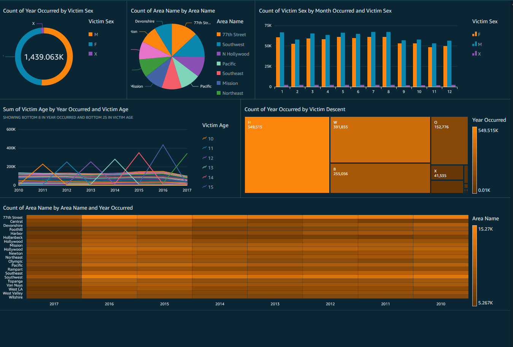

# Managing_Large_Data

## The Raw Data at a glance.
At a glance. This dataset has 1,584,315 rows and 26 columns. The dataset is also filled with missing values, null/Nan cells, information that is incomplete and consolidated information that should have its own column(s). In its current form. This information is difficult to work with, so adjustments to the datset is necessary.

Data in Raw Form

| DR Number     | Date Reported |Date Occurred| Time Occurred | Area ID | Area Name | Reproting District | MO Codes | Victim Age |
|---------------| :-------------|-------------|---------------|---------|-----------|--------------------|----------|------------|
| 1208575       |03/14/2013     | 03/11/2013  |     1800      |   12    |77th Street|1241                |          |     30     |
| 102005556     | 01/25/2010    | 01/22/2010  |               |   20    |Olympic    |2071                |          |            |
| 101822289     | 11/11/2101    | 11/10/2010  |     1800      |   18    |Southeast  |1823                |          |     18     | 

## Adjustments to the document.
Once it was determined what information I could and could not use; I went ahead and removed them from the set. Upon review, I also realized that I could add an entirely new column called "Difference" which is the difference (in days) from the day the crime occrred and reported. I also thought it prudent to seperate the geolaction column into two individual columns for latitude/longitude and change the date format. I also did the same to the "Date Occurred" column where I seperated by month and year.

After Cleaning the Information

| Date Reported |Date Occurred  | Time Occurred | Area ID | Area Name | Reporting District | Victim Sex | Difference|Longitude|Latitude|
|---------------| :-------------|-------------|---------|---------  |--------------------|------------|------------|---------|---------|
| 2017-07-21    | 2017-07-20    |     2000    |   10    |West Valley|1047                |     M      |     1      |0.0000   |0.0000   |
| 2017-07-21    | 2017-07-212   |     1000    |   10    |West Valley|1008                |     M      |     0      |0.0000   |0.0000   | | 2017-04-22    | 2017-04-21    |     1930    |    2    |Rampart    |201                 |     0      |     1      |34.0886  |-118.297 | 

## Actionable Information
Now that the data is manageable. We can create insights. In order to create a coherent dashboard. 

  

### Tools used for this project
- Python 3.8.2
- AWS Quicksight
- MS EXCEL

